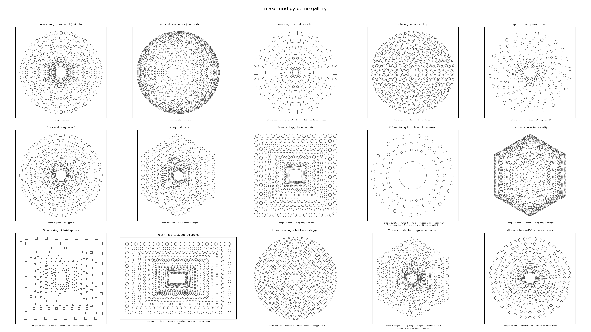

# perforata.py — Parametric Cutout Grid Generator

Generate DXF files of cutout patterns arranged on concentric rings with
**variable density** — the ring spacing follows a mathematical function
(exponential, quadratic, or linear), and the cutout sizes scale
proportionally with the local spacing. Perfect for laser-cut / CNC fan
grills, speaker covers, ventilation panels, and decorative screens.



## Requirements

Just [uv](https://docs.astral.sh/uv/). The script uses inline dependency
metadata (PEP 723), so `uv` automatically creates an isolated environment
with `ezdxf` and `matplotlib` on first run — no manual installs, no venv
management, no `requirements.txt`.

### Installing uv

**Windows (PowerShell):**
```powershell
powershell -ExecutionPolicy ByPass -c "irm https://astral.sh/uv/install.ps1 | iex"
```

**macOS / Linux:**
```bash
curl -LsSf https://astral.sh/uv/install.sh | sh
```

**Alternative package managers:**
```bash
# winget (Windows)
winget install --id=astral-sh.uv -e

# Homebrew (macOS)
brew install uv

# pipx (any platform with Python)
pipx install uv
```

After installing, restart your terminal so `uv` is on your PATH. Verify with:
```bash
uv --version
```

## Quick Start

```bash
# Default: 15 exponential rings of hexagons -> cuts.dxf
uv run perforata.py

# Live preview without writing a file
uv run perforata.py --preview --no-dxf

# 120mm fan grill: circles, hub clearance hole, 3mm minimum hole size
uv run perforata.py --shape circle --diameter 120 --center-hole 40 --min-hole 3 --out fan_grill.dxf

# Render the demo gallery image (see above)
uv run perforata.py --demo
```

Every run prints its reproducible parameter string, the final pattern
extent, and the hole size range:

```
Parameters: perforata.py --shape circle --diameter 120 --center-hole 40 --min-hole 3
Pattern extent: 120.00 x 120.00 units | hole sizes: 3.02 to 5.59 (inscribed dia)
Generated fan_grill.dxf: 15 circle rings of circles using exponential spacing (682 cutouts).
```

Preview windows and demo gallery panels also display their exact CLI
parameters, so any result you see can be reproduced by copy-pasting.

## How It Works

1. **Ring placement** — ring *n* sits at radius `r(n)` given by the spacing
   `--mode`:
   - `exponential`: `r0 * factor^n` (each gap grows by a percentage)
   - `quadratic`: `r0 + factor * n²`
   - `linear`: `r0 + factor * n` (uniform spacing)
2. **Cutout sizing** — each cutout's size is proportional to the local gap
   between rings (`gap * --fill`), so density scales consistently.
3. **Cutout count** — the number of cutouts per ring is the ring perimeter
   divided by the local gap, keeping the packing ratio uniform (unless
   overridden with `--spokes` or `--corners`).
4. **Scaling** — with `--diameter` the finished pattern, including cut
   extents, is scaled to your exact physical size. With `--rect` the pattern
   is scaled uniformly to fit inside the given rectangle: the tighter axis
   matches exactly, and the other may come out slightly smaller (the cutouts
   add an equal margin all around the outer ring, which shifts the overall
   aspect ratio a little — distorting the cutouts to compensate would ruin
   them for cutting).

## CLI Reference

### Output
| Flag | Default | Description |
|---|---|---|
| `--out FILE` | `cuts.dxf` | Output DXF file name |
| `--preview` | off | Show an interactive matplotlib preview |
| `--no-dxf` | off | Skip writing the DXF (iterate visually with `--preview`) |
| `--demo` | off | Render a gallery of example configurations and exit |
| `--demo-out FILE` | `demo_grid.png` | Gallery image path |

### Pattern geometry
| Flag | Default | Description |
|---|---|---|
| `--shape {circle,square,hexagon}` | `hexagon` | Cutout shape |
| `--ring-shape {circle,square,hexagon,rect}` | `circle` | Shape of the concentric rings |
| `--rect W H` | — | Bounding rectangle for `--ring-shape rect` (required with it); the pattern is scaled uniformly to fit inside it |
| `--rings N` | `15` | Number of concentric rings |
| `--mode {exponential,quadratic,linear}` | `exponential` | Ring spacing function |
| `--r0 R` | `10.0` | Radius of the innermost ring (must be > 0 in `exponential` mode) |
| `--factor F` | `1.15` | Growth factor for the spacing function |
| `--fill F` | `0.35` | Cutout size relative to local spacing (keep < 0.5) |
| `--invert` | off | Flip density: smallest/densest rings on the outside |

### Physical size control (for real-world parts)
| Flag | Default | Description |
|---|---|---|
| `--diameter D` | — | Scale the whole pattern to exactly this outer size (e.g. `120` for a 120mm fan) |
| `--min-hole S` | `0` | Drop holes narrower than S (inscribed diameter) — respect your cutter's minimum feature size |
| `--min-wall S` | `0` | Guarantee at least S of material between neighboring cutouts — the fill factor is reduced globally (preserving proportions) until the narrowest wall meets S |
| `--center-hole S` | `0` | Add a center cutout with inscribed diameter S (e.g. hub clearance) |
| `--center-shape {circle,square,hexagon}` | `circle` | Shape of the center cutout |

### Angular controls (all angles in degrees)
| Flag | Default | Description |
|---|---|---|
| `--rotation DEG` | `0` | Extra rotation applied to every cutout |
| `--rotation-mode {normal,global}` | `normal` | `normal`: relative to each cutout's local outward normal; `global`: one absolute angle for all |
| `--ring-rotation DEG` | `0` | Rotate the ring shape itself (polygon rings, or start angle on circles) |
| `--center-rotation DEG` | `0` | Rotate the center cutout independently |
| `--twist DEG` | `0` | Cumulative rotation per ring (spiral effect; pair with `--spokes`) |
| `--stagger F` | `0` | Offset each ring by a fraction of its own pitch (e.g. `0.5` = brickwork) |

### Distribution overrides
| Flag | Default | Description |
|---|---|---|
| `--spokes N` | `0` (auto) | Force exactly N cutouts per ring, aligned into radial spokes — makes `--twist` show clear spiral arms |
| `--corners` | off | On polygonal rings, anchor a cutout on each corner and distribute the rest along the sides (ignores twist/stagger/spokes) |

## Recipes

```bash
# Classic 120mm PC fan grill with structural guarantees:
# no hole under 3mm, no wall thinner than 2mm
uv run perforata.py --shape circle --diameter 120 --center-hole 42 --min-hole 3 --min-wall 2 --rings 8 --r0 6 --factor 1.25 --out fan120.dxf

# Spiral galaxy screen
uv run perforata.py --shape hexagon --spokes 24 --twist 10 --preview

# Brickwork-staggered square vents
uv run perforata.py --shape square --stagger 0.5 --rotation-mode global

# Hexagonal panel with hex rings, corner-anchored cutouts and a hex hub
uv run perforata.py --ring-shape hexagon --corners --center-hole 12 --center-shape hexagon

# Rectangular 300x200mm vent panel, dense at the edges
uv run perforata.py --shape circle --ring-shape rect --rect 300 200 --invert --out vent.dxf

# Try parameters visually before committing to a file
uv run perforata.py --preview --no-dxf --mode quadratic --factor 2 --rings 10
```

## Notes

- **Units** are dimensionless in the DXF; treat them as millimeters (or
  inches) in your CAM software. `--diameter` / `--rect` define the true
  physical size.
- **Hole sizes** are reported as *inscribed diameters* (the narrowest
  opening), which is the measurement that matters for airflow and minimum
  cut feature checks.
- **`--min-hole` and sizing resolve together.** Scaling to a target size
  changes hole sizes, and dropping undersized holes can shrink the pattern
  extent (e.g. with `--invert`, where the densest rings are outermost). The
  script iterates scale → filter until both constraints hold at once: every
  surviving hole meets the minimum size *and* the surviving pattern fills
  the requested `--diameter` / `--rect` exactly.
- **`--min-wall` shrinks fill globally.** If the narrowest wall between any
  two cutouts (including the center hole) is thinner than requested, the
  script uniformly reduces the fill factor and rebuilds the whole pattern
  until the constraint is met, keeping the proportional look intact. It
  prints the adjusted fill so you can record it. The center hole is a
  fixed-size feature and never shrinks — if it sits too close to the inner
  ring to leave room for the wall, you'll get a warning suggesting a smaller
  `--center-hole` or a larger `--r0`. Wall gaps are measured with bounding
  circles: exact for circle cutouts, slightly conservative (safe) for
  squares and hexagons.
- `--fill` values at or above `0.5` can cause neighboring cutouts to touch
  or overlap; the default `0.35` leaves sturdy webbing between holes.
- All cut geometry is emitted as native DXF `CIRCLE` and closed
  `LWPOLYLINE` entities — clean input for laser/CNC/waterjet CAM tools.
