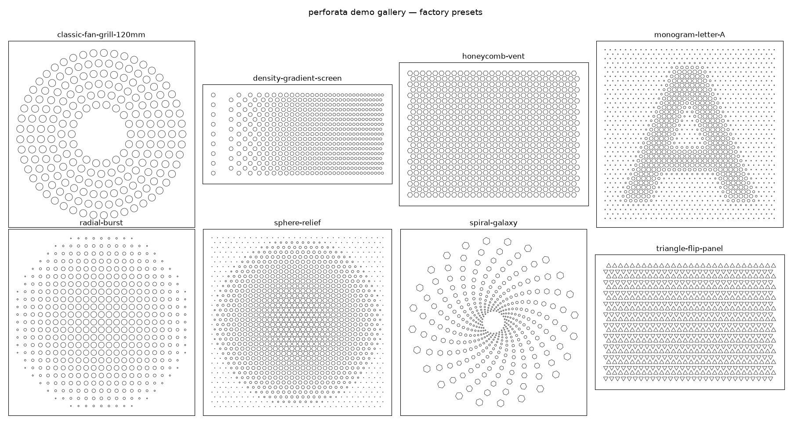

# perforata — Parametric Perforation Pattern Generator

Generate manufacturable cutout patterns (fan grills, vent panels, speaker
covers, decorative screens) as DXF/SVG files — driven by a composable
node-graph engine with an interactive Streamlit UI.



The matrix above renders every factory preset; view it live via the
**🎬 Demo gallery** button in the UI sidebar, or regenerate the image with
`uv run python -m perforata.demo docs/demo_gallery.png`.

> The original single-file CLI version lives in [`mvp/`](mvp/) and still
> works standalone. This is its structured successor.

## Architecture

Patterns are built as a **graph of small, well-posed processing nodes**
(think Blender Geometry Nodes / Grasshopper, in miniature):

```
Generators ──▶ Modifiers ──▶ Decorators ──▶ Ops ──▶ Exporters
 (centers)     (transform)    (cut shapes)   (crop,  (DXF/SVG)
                   ▲                          filters)
                   │
                Fields (images, gradients, expressions)
```

* **Generators** (`perforata.generators`) produce a `PointCloud` of grid
  centers with attributes (`angle`, `size`, `tag`, lattice coords). The
  theoretical basis is a 2D **Bravais lattice**: points are integer
  combinations of two basis vectors, optionally decorated with a
  multi-point unit cell. Included: `CartesianGrid` (with row/column
  `stagger` for brickwork layouts), `HexGrid`, `ConcentricRings` (the
  MVP's radial system), and the general `Lattice`. Cartesian/hex grids
  accept `fit=True` to snap the pitch so a whole number of cells spans
  the panel and edge margins come out balanced on all sides.
* **Fields** (`perforata.fields`) are scalar functions over the unit
  square: `ImageField` (sample a logo / letter), `TextField`,
  `LinearGradient`, `RadialGradient`, `ShapeGradient`, `Expression`.
  Fields compose with `+ - *` operators.
* **Modifiers** (`perforata.modifiers`) transform point clouds:
  `Affine` (rotation / scaling / shear as proper 2×2 matrix ops that keep
  per-point orientations and sizes consistent), `PolarWarp` (bend a
  cartesian grid into a circle), `FieldModulate` — the "convolve an
  image with the grid" mechanism that drives any point attribute from a
  sampled field — and `DensityWarp`, which remaps grid spacing so point
  density follows a field. Field-sampling modifiers accept
  `region="symmetric"` to map the field over an origin-centered box, so
  radial patterns whose bounding box is slightly lopsided keep the field
  centered on the true pattern center.
* **Decorators** (`perforata.decorators`) instance actual cutout geometry
  onto points. `ShapeInstancer` maps **tags → shape recipes**, so rows
  tagged `even`/`odd` can get up/down triangles, and `major`/`minor` rows
  can get different shapes entirely. This separation of *where centers
  are* from *what is cut there* is the core design change from the MVP.
* **Ops** (`perforata.ops`) handle manufacturability: `Crop` (true
  shapely boolean intersection for flush panel edges — or cull/center
  modes), `MinHoleFilter`, `MinWall`, `FitToSize`.
* **Exporters** (`perforata.exporters`) write DXF (`ezdxf`) or SVG, to a
  path or to bytes (for UI download buttons).

## Quick start

Requires [uv](https://docs.astral.sh/uv/).

```bash
# Interactive UI
uv run streamlit run app.py

# Run the test suite
uv run --group dev pytest
```

## Presets

Pipelines can be stored, reloaded and shared:

* **Factory presets** — curated pipelines shipped with the repo, defined
  as code in `perforata/factory_presets.py` (tracked in git). Load them
  from the "Factory presets" section in the UI sidebar.
* **User presets** — save the current UI pipeline into `presets/user/`
  (git-ignored) as a `.pfp` file, serialized with **cloudpickle** so
  everything survives: closures, compiled field expressions, and numpy
  image data inside `ImageField`. The "Share" button downloads the same
  bytes for sending to someone else, who can import it via the file
  uploader.

> ⚠️ `.pfp` files are pickle-based and execute code on load — only load
> presets from sources you trust.

The **🎬 Demo gallery** sidebar button renders all factory presets into a
single matrix image (the successor of the MVP's `--demo` grid), with a
download button for the PNG. The same renderer runs headlessly through
`perforata.demo` — no Streamlit needed.

## Using the library

```python
from perforata.generators import CartesianGrid
from perforata.modifiers import FieldModulate
from perforata.fields import ImageField
from perforata.decorators import ShapeInstancer, ShapeSpec
from perforata.ops import Boundary, Crop
from perforata.exporters import DXFExporter
from perforata.graph import Pipeline

# Triangles alternating orientation row by row, sized by a logo image
Pipeline(
    CartesianGrid(pitch_x=8, pitch_y=8, width=300, height=200,
                  alternate=True),
    FieldModulate("scale", ImageField("logo.png", invert=True),
                  lo=0.15, hi=1.0),
    ShapeInstancer(rules={
        "even": ShapeSpec("triangle", fill=0.45, rotation=90),
        "odd":  ShapeSpec("triangle", fill=0.45, rotation=-90),
    }),
    Crop(Boundary.rect(300, 200), mode="cull", include_outline=True),
    DXFExporter("panel.dxf"),
).run()
```

For non-linear compositions (shared upstream nodes, multiple generators
merged), use `perforata.graph.Graph`:

```python
from perforata.graph import Graph
from perforata.modifiers import TagFilter, Merge

g = Graph()
g.add("grid", CartesianGrid(pitch_x=10, pitch_y=10, width=100,
                            height=100, alternate=True))
g.add("even", TagFilter("even"), "grid")
g.add("odd", TagFilter("odd"), "grid")
g.add("merged", Merge(), "even", "odd")
g.add("cuts", ShapeInstancer(shape="circle", fill=0.5), "merged")
shapes = g.run("cuts")
```

## Notes

* Units are dimensionless; treat them as millimeters in CAM. `FitToSize`
  and `Boundary` define true physical dimensions.
* Hole `size` is always the **inscribed diameter** (narrowest opening) —
  the measurement that matters for airflow and minimum-feature checks.
* `ShapeSpec.fill` scales that inscribed diameter relative to the local
  grid pitch, for every shape: at `fill=1.0` neighboring cutouts touch,
  regardless of whether they are circles, hexagons or triangles. Keep it
  below 1.0 to leave walls between holes.
* `Crop(mode="slice")` boolean-cuts straddling shapes flush with the
  panel edge; `mode="cull"` keeps only whole cutouts (usually best for
  perforation panels, since edge slivers can be unmanufacturable).
* The UI's Export section includes a **Config dump (.txt)** button: a
  plain-text report of the widget state and the constructed node
  pipeline (plus result stats), for debugging and bug reports.

## License

perforata is licensed under the **GNU Affero General Public License
v3.0 or later** ([LICENSE](LICENSE)). You are free to use, modify, and
share it; if you distribute a modified version or offer it as a network
service, you must make your source available under the same terms. For
commercial licensing outside the AGPL (e.g. embedding the engine in a
proprietary CAD plugin), contact the author.

Contributions are welcome under the project's contributor license
agreement ([CLA.md](CLA.md)): you keep ownership of your work and it
always stays available under the open-source license, while granting
the project the rights needed to also offer commercial licenses. State
your agreement in your first pull request.
